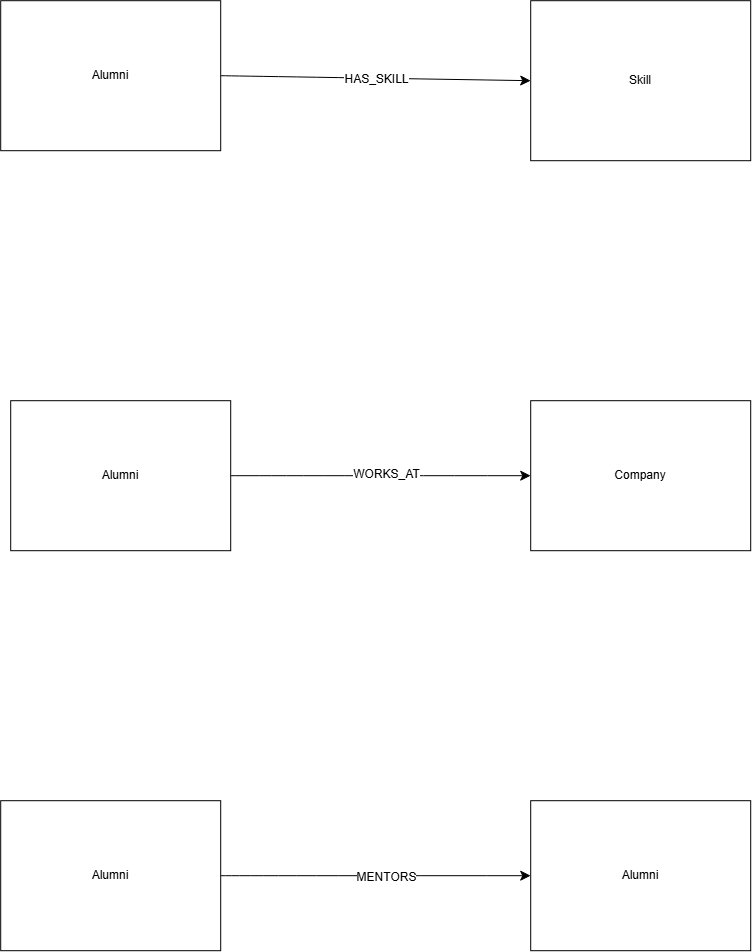
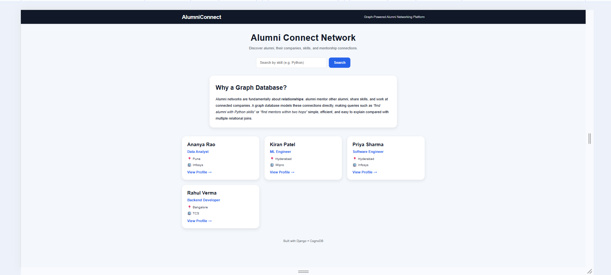
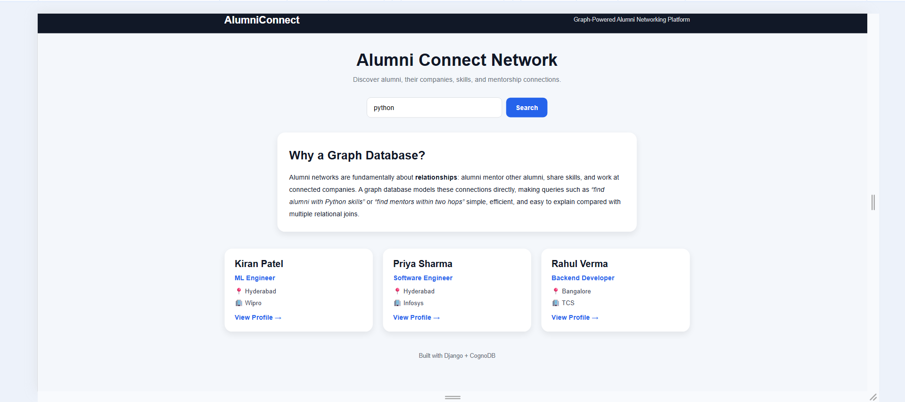
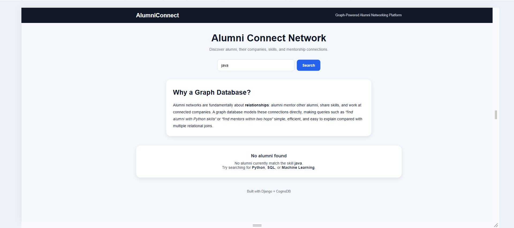
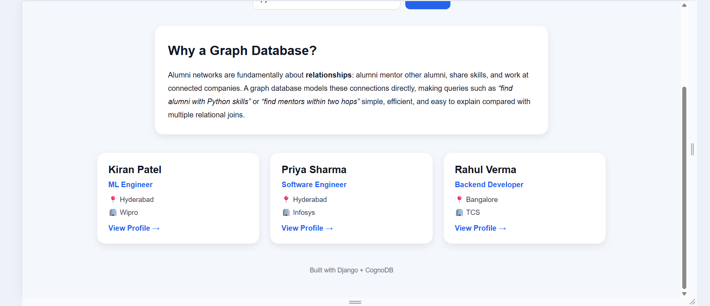
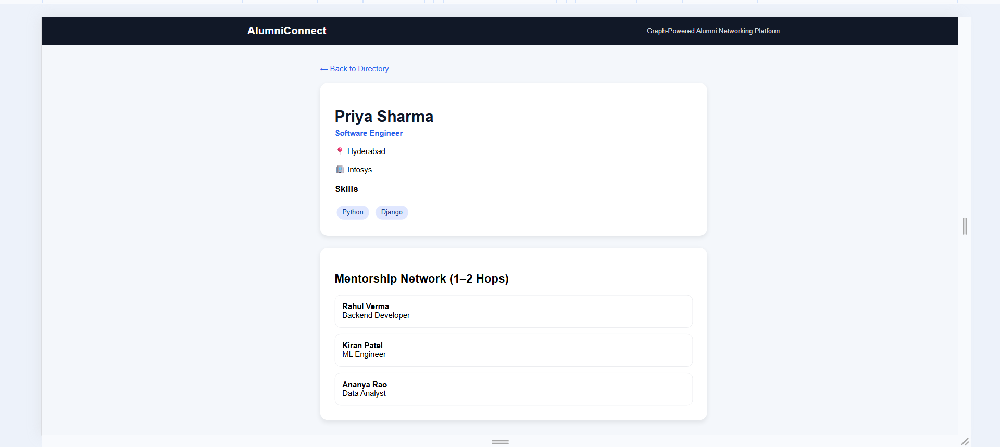

# AlumniConnect Network

A graph-powered alumni networking platform built with **Django** and **CognoDB (Neo4j-compatible graph database)**. The application demonstrates how graph databases naturally model relationships such as alumni skills, companies, and mentorship connections.

## Live Demo

🔗 https://alumni-connect-network.onrender.com

## GitHub Repository

🔗 https://github.com/deekshithaanyaboina22-alt/alumni-connect-network

---

## Problem Statement

Traditional relational databases require multiple joins and recursive queries to answer relationship-heavy questions such as:

* Which alumni know Python?
* Who can mentor me within two connections?
* Which alumni work at related companies?

A graph database stores these connections directly, making traversal queries simpler and more efficient.

---

## Technology Stack

* **Backend:** Django 6
* **Database:** CognoDB (Neo4j-compatible)
* **Graph Driver:** Official Neo4j Python Driver
* **Frontend:** HTML, CSS
* **Deployment:** Render
* **Version Control:** Git & GitHub

---

# Graph Data Model



### Node Types

* `Alumni`
* `Skill`
* `Company`

### Relationship Types

* `HAS_SKILL`
* `WORKS_AT`
* `MENTORS`

---

# Key Features

* Alumni directory
* Search alumni by skill
* Alumni profile page
* Skills display
* Company display
* Mentorship network (1–2 hop traversal)
* Empty search state
* Graceful database error handling

---

# Main Cypher Queries

## 1. List all alumni with company

```cypher
MATCH (a:Alumni)-[:WORKS_AT]->(c:Company)
RETURN a.name, a.title, c.name
ORDER BY a.name
```

## 2. Search alumni by skill

```cypher
MATCH (a:Alumni)-[:HAS_SKILL]->(s:Skill),
      (a)-[:WORKS_AT]->(c:Company)
WHERE toLower(s.name) = toLower($skill)
RETURN DISTINCT a.name, a.title, c.name
ORDER BY a.name
```

## 3. Two-hop mentorship traversal

```cypher
MATCH (a:Alumni {id:$id})-[:MENTORS*1..2]->(m:Alumni)
RETURN DISTINCT m.name, m.title
```

This traversal is significantly simpler than recursive joins in a relational database.

---

# Application Screenshots

## Homepage



## Skill Search



## Empty Search State



## Alumni Profile



## Mentorship Network



---

# Local Setup

## 1. Clone the repository

```bash
git clone https://github.com/deekshithaanyaboina22-alt/alumni-connect-network.git
cd alumni-connect-network
```

## 2. Create virtual environment

```bash
py -3.12 -m venv venv
venv\Scripts\activate
```

## 3. Install dependencies

```bash
pip install -r requirements.txt
```

## 4. Configure environment variables

Create a `.env` file:

```env
COGNODB_URI=your_cognodb_uri
COGNODB_USER=cognodb
COGNODB_PASSWORD=your_password
```

## 5. Run migrations

```bash
py -3.12 manage.py migrate
```

## 6. Seed graph data

```bash
py -3.12 network/scripts/seed.py
```

## 7. Start the server

```bash
py -3.12 manage.py runserver
```

Open: http://127.0.0.1:8000/

---

# Project Structure

```text
backend/          Django configuration
network/          Application code
network/scripts/  Graph seed script
screenshots/      README images
QUERIES.md        Query explanations
```

---

# Why Graph Databases?

This project demonstrates that graph databases are ideal for:

* social networks,
* mentorship systems,
* recommendation engines,
* professional networking platforms,
* relationship analytics.

The ability to traverse connected data with pattern matching is the primary advantage over relational modeling.

---

# Author

**Deekshitha Anyaboina**

* GitHub: https://github.com/deekshithaanyaboina22-alt
* LinkedIn:  https://www.linkedin.com/in/deekshitha-anyaboina/
